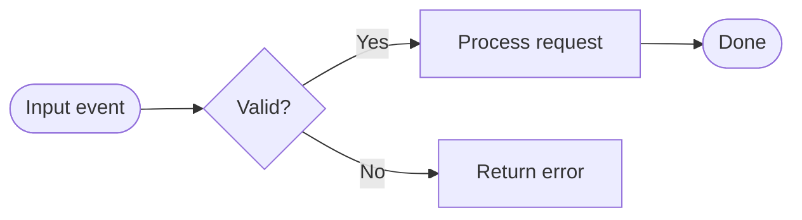
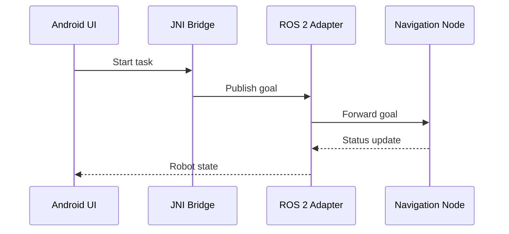

# Diagram Standards

## Architecture Images With Image Gen

Use Image Gen for high-quality architecture overview and local relationship diagrams. The target is a clean software architecture diagram, not an illustration.

### Image Gen Prompt Contract

Include these fields in every architecture-image prompt:

- Purpose: whole-system overview or local subsystem view.
- Audience: senior engineers and technical stakeholders.
- Style: clean modern software architecture diagram, white or light neutral background, sharp vector-like lines, readable labels, no decorative characters, no stock-photo style.
- Layout: group by runtime boundary, deployment boundary, or layer. Make the whole/local relationship obvious.
- Nodes: exact component names, one short responsibility per major group when useful.
- Edges: labeled data/control flow arrows with protocol or data type where known.
- Emphasis: highlight critical paths and external dependencies.
- Constraints: avoid tiny text, avoid 3D, avoid photorealism, avoid decorative icons unless they clarify domain.
- Output: 16:9 landscape PNG unless the user asks otherwise.

Example prompt shape:

```text
Create a clean 16:9 software architecture diagram for a robot dual-board system.
Audience: senior robotics software engineers.
Style: white background, crisp vector-like architecture diagram, readable labels, standard module boxes, grouped runtime boundaries.
Show two deployment groups: RK3588S Android 12 business layer and AGX Orin Ubuntu 22.04 ROS 2 Humble core robotics layer.
Nodes: Android app UI/task manager, JNI bridge, ROS 2 Android adapter, Orin ROS 2 node graph, perception, localization, planning, control, hardware drivers.
Edges: task commands Android -> Orin via ROS 2; robot state Orin -> Android; sensor streams into perception; control commands to hardware.
Label arrows with protocol/data where known. Make whole-system and local relationships clear.
Avoid decorative illustration, tiny text, 3D, gradients, and stock-photo styling.
```

Store the final image under `assets/`, for example `assets/architecture-overview.png`, and include the prompt in the Markdown appendix.

## Architecture Diagram Content

A good architecture diagram must show:

- System boundary and external actors/systems.
- Runtime/deployment boundaries.
- Major modules or services.
- Data and control direction.
- Protocols, buses, files, or API types.
- Ownership of key decisions or state.
- Important local subsystem internals when needed.

Do not overload one image. If more than 10-14 major nodes are needed, produce a whole-system view plus local views.

## Flowcharts With Mermaid

Use Mermaid for flowcharts:



Standards:

- Use `flowchart LR` for pipeline/data-flow style, `flowchart TD` for decision-heavy processes.
- Prefer verb phrases for steps: "Validate command", "Publish goal", "Update state".
- Use diamonds for decisions.
- Show failure paths when source evidence supports them.
- Keep each diagram focused on one core workflow.
- Split diagrams when a flow has too many branches to read.

## Sequence Diagrams With Mermaid

Use Mermaid for interaction timing:



Standards:

- Participants should be runtime actors, not broad folders.
- Use `->>` for calls/messages and `-->>` for responses/events.
- Add `alt`, `opt`, `loop`, or `par` blocks when the source shows branching, optional paths, retries, or concurrent behavior.
- Label messages with exact API/topic/service names when known.
- Include timeout/error handling where implemented.

## Review Checklist

- Are labels readable without zooming?
- Are all arrows directional and meaningful?
- Are protocols/data types shown on important edges?
- Are confirmed and inferred relationships distinguishable in Markdown?
- Is each diagram tied back to evidence?
- Are Mermaid diagrams valid enough to render in common Markdown viewers and HTML?
